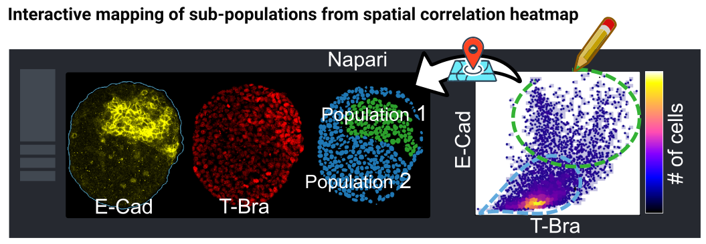
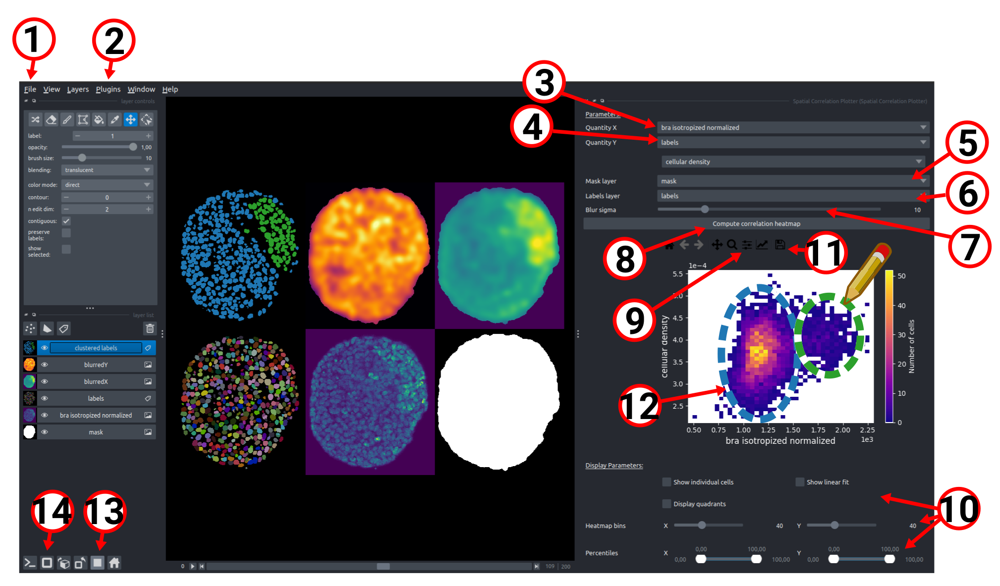
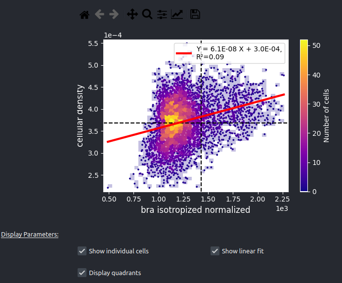

# :herb: napari-spatial-correlation-plotter

A plugin to dynamically interact with the spatial correlation heatmap obtained by comparing two continuous fields of biophysical properties in 3D tissues.

If you use this plugin for your research, please [cite us](https://github.com/GuignardLab/tapenade/blob/main/README.md#how-to-cite).

`napari-spatial-correlation-plotter` is a [napari] plugin that is part of the [Tapenade](https://github.com/GuignardLab/tapenade) project. Tapenade is a tool for the analysis of dense 3D tissues acquired with deep imaging microscopy. It is designed to be user-friendly and to provide a comprehensive analysis of the data.

## Overview

While working with large and dense 3D and 3D+time gastruloid datasets, we found that being able to visualise and interact with the data dynamically greatly helped processing it.
During the pre-processing stage, dynamical exploration and interaction led to faster tuning of the parameters by allowing direct visual feedback, and gave key biophysical insight during the analysis stage.

This plugins allows the user to analyse the spatial correlations of two 3D fields loaded in Napari (e.g two fluorescent markers). The user can dynamically vary the analysis length scale, which corresponds to the standard deviation of the Gaussian kernel used for smoothing the 3D fields. 
If a layer of segmented nuclei instances is additionally specified, the histogram is constructed by binning values at the nuclei level (each point corresponds to an individual nucleus). Otherwise, individual voxel values are used.
The user can dynamically interact with the correlation heatmap by manually selecting a region in the plot. The corresponding cells (or voxels) that contributed to the region's statistics will be displayed in 3D on an independant Napari layer for the user to interact with and gain biological insight.

## Installation

The plugin obviously requires [napari] to run. If you don't have it yet, follow the instructions [here](https://napari.org/stable/tutorials/fundamentals/installation.html).

The simplest way to install `napari-spatial-correlation-plotter` is via the [napari] plugin manager. Open Napari, go to `Plugins > Install/Uninstall Packages...` and search for `napari-spatial-correlation-plotter`. Click on the install button and you are ready to go!

You can also install `napari-spatial-correlation-plotter` via [pip]:

    pip install napari-spatial-correlation-plotter

To install latest development version :

    pip install git+https://github.com/jules-vanaret/napari-spatial-correlation-plotter.git

## Usage

Steps:
1. First, load your images (and optionally mask and labels) in Napari. You can drag and drop them from your file explorer to the Napari viewer, or open them using the `File > Open files...` menu.
2. Click on the `Plugins > Spatial Correlation Plotter` menu to open the plugin.
3. Select the first layer you want to study from the combo box `Quantity X`.
4. Select the second layer you want to study from the combo box `Quantity Y`. In this example, labels have loaded in step 1. Labels layers can be chosen as `Quantity X` or `Quantity Y` so that the quantity to study is the object instance density (in this example, the labels come from nuclei segmentation, so this leads to studying the nuclei density, or equivalently the cell density) or instance volume fraction.
5. Optionally, a mask layer (with boolean values, 0 for outside, 1 for inside) can be selected to restrict the analysis to a specific region of the image.
6. Optionally, a labels layer can be selected so that the histogram is constructed by binning values obtained by averaging the two fields in the segegmented instances (in this case, the quantitites will be averaged inside nuclei).
7. Use the `Blur sigma` slider to vary the length scale of the analysis. This corresponds to the standard deviation of the Gaussian kernel used for masked gaussian smoothing the 3D fields. If set to 0, no smoothing is applied, which can be useful to study the raw data or if the quantities are already coming from smoothed data.
8. Click on the `Compute correlation heatmap` button to compute and plot the correlation heatmap.
9. If the image does not properly fit in the window (e.g if the borders are cut), you can use the `Configure subplots > Tight layout` button to adjust the plot size.
10. You can adjust the histogram binning by changing the `Heatmap bins` sliders. If the histogram range is too large (e.g due to outliers), you can adjust the `Percentiles` sliders to focus on the most relevant part of the histogram. You can also check options to (i) `Show individual cells` to display the individual points that compose the histogram as an additional scatter, (ii) `Show linear fit` to display the linear fit of the histogram, (iii) `Display quadrants` to display vertical and horizontal lines that divide the histogram in 4 quadrants. The lines are placed at the median of the histogram values in X and Y. For instance, once checked, these options lead to the following plot:

11. You can click on the `Save the figure` button to save the current plot (many formats are available, including .png, .svg, .jpeg).
12. You can interact with the plot by manually drawing a region of interest directly on the plot to automatically select and display the corresponding cells in 3D on an independant Napari Labels layer `clustered labels`. By using a left click, you can draw an arbitrary shape. By using a right click, you can draw a rectangle. If `Shift` is pressed while drawing, several groups of cells can appear on the `clustered labels` layer, each with a different color.
13. To trigger the grid view like in the example image, you can click on the `Toggle grid mode` button. This will display all layers in a grid view. By right clicking the button, you can parametrize the grid view (e.g number of columns, number of rows, etc).
14. You can switch between 2D and 3D view at all time by clicking on the `Toggle 2D/3D view` button (it resembles a square when in 2D mode, or a cube when in 3D mode).

## Acknowledgements

The "napari-clusters-plotter" plugin [1] heavily inspired this plugin, most notably the `SelectFromCollection`, `MplCanvas` and `FigureToolbar` classes. The `PlotterWidget` class has been modified for the specific use case of this plugin, but the core functionalites have been adapted directly.
napari-clusters-plotter source code is available [here](https://github.com/BiAPoL/napari-clusters-plotter/tree/main).

[1] Zigutyte, L., Savill, R., Müller, J., Zoccoler, M., Wagner, T., & Haase, R. (2023). napari-clusters-plotter. Zenodo. https://doi.org/10.5281/zenodo.5884657

## Contributing

Contributions are very welcome. Tests can be run with [tox], please ensure
the coverage at least stays the same before you submit a pull request.

## License

Distributed under the terms of the [MIT] license,
"napari-spatial-correlation-plotter" is free and open source software

## Issues

If you encounter any problems, please [file an issue] along with a detailed description.

----------------------------------

This [napari] plugin was generated with [Cookiecutter] using [@napari]'s [cookiecutter-napari-plugin] template.

[napari]: https://github.com/napari/napari
[Cookiecutter]: https://github.com/audreyr/cookiecutter
[@napari]: https://github.com/napari
[MIT]: http://opensource.org/licenses/MIT
[BSD-3]: http://opensource.org/licenses/BSD-3-Clause
[GNU GPL v3.0]: http://www.gnu.org/licenses/gpl-3.0.txt
[GNU LGPL v3.0]: http://www.gnu.org/licenses/lgpl-3.0.txt
[Apache Software License 2.0]: http://www.apache.org/licenses/LICENSE-2.0
[Mozilla Public License 2.0]: https://www.mozilla.org/media/MPL/2.0/index.txt
[cookiecutter-napari-plugin]: https://github.com/napari/cookiecutter-napari-plugin

[file an issue]: https://github.com/jules-vanaret/napari-spatial-correlation-plotter/issues

[napari]: https://github.com/napari/napari
[tox]: https://tox.readthedocs.io/en/latest/
[pip]: https://pypi.org/project/pip/
[PyPI]: https://pypi.org/
